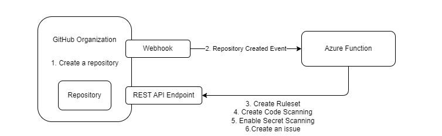

# GitHub Repository Branch Protection

## Summary

This repository contains a project that protects the main branch of newly created repositories by using rulesets. It listens to organization webhooks to get notified whenever a new repository is created.

We use C#/.NET 9 and Azure Functions.

## Features

- Listen to GitHub organization webhook repository events.
- Create a ruleset to protect the main branch of new repositories.
- Notify a user that the main branch has been protected by creating an issue and mention the user.



## Prerequisites

To run the application, you need:

- GitHub account and a [GitHub organization](https://docs.github.com/en/organizations).
- [GitHub App](https://docs.github.com/en/developers/apps/building-github-apps/creating-a-github-app) for authorizing the use of GitHub REST API.
- [GitHub Organization Webook](https://docs.github.com/en/webhooks)
- [Azure Subscription](https://portal.azure.com) to host the application on Azure Function.
- [.NET 9 SDK](https://dotnet.microsoft.com/en-us/download/dotnet/9.0)
- [Azure Functions related tools](https://learn.microsoft.com/en-us/azure/azure-functions/functions-reference)

We use Azure Functions [isolated worker model](https://learn.microsoft.com/en-us/azure/azure-functions/dotnet-isolated-process-guide) to run .NET 9 application.

### GitHub App

As listed above, we use GitHub App to authenticate against the GitHub API. As we use Organization level webhook, you need to register the application in an organization level. 
See [Register GitHub App](./RegisterGitHubApp.md) for the detail steps.

### GitHub Webhook

We relies on GitHub organization webhook to get notification whenever a repository has been created.
See [Create WebHook](./CreateWebHook.md) for detail steps.

### GitHub REST API

The Azure Functions app consumes the GitHub REST API to create a ruleset and an issue. See following links for more detail.

- [Create a RuleSet](https://docs.github.com/en/rest/repos/rules?apiVersion=2022-11-28#create-a-repository-ruleset) for applying branch protection rules.
- [Create an Issue](https://docs.github.com/en/rest/issues/issues?apiVersion=2022-11-28#create-an-issue) for creating issues to notify users.

## Getting Started

To get started with this project, follow the steps below:

1. Clone the repository:
    ```sh
    git clone https://github.com/yourusername/ghwebhook.git
    ```
1. Navigate to the project directory:
    ```sh
    cd ghwebhook
    ```
1. Open the project in your preferred IDE.
1. Rename the `.local.settings.json` to `local.settings.json` by removing the `.` at the beginning and fill the value by follownig the next section.
1. Build the project to restore dependencies and compile the code.

### Configuration - local.settings.json

Configure the Azure Function app in the `appsettings.json` file. You will need to provide followins:

- GitHubUserName: A GitHub user name to nofity via an issue.
- GitHubApplicationId: The application Id of the GitHub App.
- GitHubApplicationPemFilePath: The path to the pem file you downloaded from the GitHub App page.

### Debug locally

If you want to run the application in your local environment, you need setup the tunnel so that you can redirect the webhook post to your local computer. You can use any tools, such as dev tunnel, ngrok, etc.

See [Use ngrok for local debug](UseNgrok.md) for the detail steps.

### Deploy to Azure

Once you satisfy with the solution, you can deploy the solution the application to Azure Functions.

## Considerations

### Security Considerations

We are storing the pem file direclty in the project and copies it to Azure Functions, which is not ideal from security point of view. Please consider using [Azure KeyVault Certificates](https://learn.microsoft.com/en-us/azure/key-vault/certificates/) and use [Managed Identity](https://learn.microsoft.com/en-us/azure/app-service/app-service-key-vault-references?tabs=azure-cli) to retrive the pem file for Azure Functions.

### Architecture Considerations

As webhook won't resend the event in any case, we need to make sure to store the event and handle them appripriately. The current architecutre receives the event directly in the Azure Function, that may cause the issue when:

- the Azure function no up and running
- the Azure function failed to process the request

To avoid the loss of the event, we can utilize services such as Azure Event Grid and store the event securely to the queueing system or database so that we can retry handling the event in case of failure.

See [Event Grid message delivery and retry](https://learn.microsoft.com/en-us/azure/event-grid/delivery-and-retry) and [Azure Functions triggers and bindings concept](https://learn.microsoft.com/en-us/azure/azure-functions/functions-triggers-bindings) to see which cloud services the Azure Function support natively as a trigger.

### Library Considerations

** Octokit **
We use [Octokit.net](https://github.com/octokit/octokit.net) to consume GitHub REST API. However, the package doesn't support `RuleSet` feature yet, thus we defines the [RuleSet](./Models/RuleSet/RuleSet.cs) model in the repo. Once the package supports the `RuleSet`, we shall upgrade the package and remove our own implementations.

** Octokit.Webhooks.AzureFunctions **
We use [Octokit.Webhooks](https://github.com/octokit/webhooks.net) for Azure Function to simplify the application. If you prefer convert the application into Web API instead, refer to the GitHub repo and update the code.

## Contributing
Feel free to contribute to this project by submitting issues or pull requests. Please follow the contribution guidelines.

## License
This project is licensed under the MIT License. See the [LICENSE](LICENSE) file for more details.
